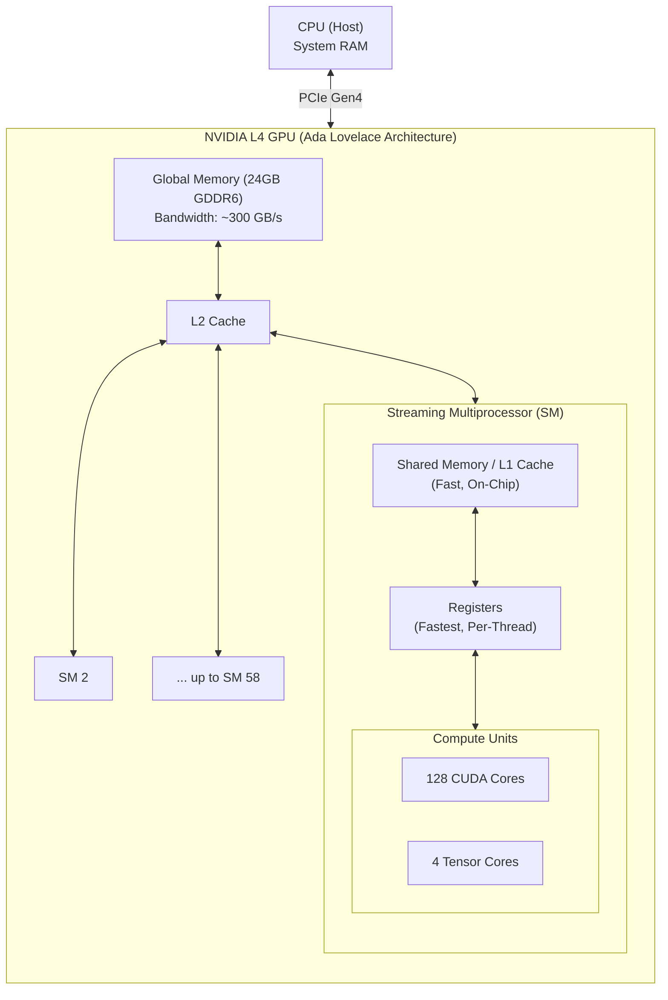

# CUDA 101: Basics of CUDA Programming

## Introduction
CUDA (Compute Unified Device Architecture) is a parallel computing platform and programming model developed by NVIDIA. It allows developers to use CUDA-enabled GPUs for general-purpose processing. 

While CPUs are designed to execute a few threads very quickly (low latency), GPUs are designed to execute thousands of threads concurrently (high throughput). This makes GPUs exceptionally well-suited for highly parallel tasks like matrix operations in deep learning.

## High-Level GPU Architecture & Terms to Know

To understand CUDA, it helps to understand the hardware it runs on. Let's use the **NVIDIA L4 GPU (Ada Lovelace architecture)** as our reference model. The L4 is widely used for inference workloads.
### The Hardware Model (Physical Entities)
- **GigaThread Engine**: The central hardware scheduler of the GPU. It takes the Grid of blocks and distributes them across available SMs.
- **Streaming Multiprocessor (SM)**: The core processing engine of the GPU. The NVIDIA L4 has **58 SMs**. 
- **Warp / Warp Scheduler**: The fundamental physical execution unit inside the SM. The hardware is hardwired to issue one instruction to exactly **32 CUDA cores** at the same nanosecond. This physical execution block is called a Warp.
- **CUDA Core**: The physical ALU that executes an instruction for a single thread. The L4 has **7,424 CUDA cores** (128 per SM).
- **Tensor Core**: Specialized execution units designed for matrix multiply-accumulate (MAC). The L4 has **232 Tensor Cores** (4 per SM).
- **Registers**: The absolute fastest memory on the chip. Each thread is allocated its own strictly private registers.
- **Shared Memory / L1 Cache**: Fast on-chip memory physically located inside the SM. It is shared exclusively by all threads within a specific Block.
- **Constant Memory**: A special read-only cache designed to instantly broadcast kernel arguments (like vector dimensions) to all threads simultaneously.
- **L2 Cache**: Cached memory shared across all SMs on the entire GPU.
- **VRAM / Global Memory**: The main 24GB GDDR6 memory of the GPU (~300 GB/s bandwidth).

### The Software Model (Logical Groupings)
- **Kernel**: A single C++ function designed to run on the GPU. When launched by the CPU, the GPU is instructed to execute this exact same function thousands of times in parallel, but giving each execution a different ID.
- **Grid**: The total collection of blocks launched for a single kernel. It is purely logical; the hardware simply sees a queue of blocks to distribute.
- **Block (Thread Block)**: A logical grouping of threads (up to 1024). While logical, it has a **strict physical constraint**: an entire block is permanently assigned to a single SM so its threads can share physical L1 memory and synchronize.
- **Thread**: The smallest logical unit of execution. A programmer writes a kernel from the perspective of a single thread, but the hardware physically executes them in Warps of 32.

### Architecture Diagram (NVIDIA L4)

## Deep Dives & Core Concepts

To truly understand how a GPU executes code, we need to dive into the physical reality of how these groupings behave during execution.

### 1. What is a Block? (And its Limitations)
A Block is a team of threads that cooperate. While it is a software concept, it carries a strict physical limitation: **An entire Block must be assigned to a single SM.** 
- Why? Because threads in a block share a physical L1 SRAM cache (Shared Memory). If half a block was on SM 1 and half on SM 2, they couldn't physically share that memory.
- **The 1024 Limit**: An SM can only physically hold a limited number of active threads (usually 1,536 or 2,048 depending on the specific GPU architecture). Because of this physical constraint, NVIDIA enforces a strict cap of **1024 threads per block**. 
- **The Hardware Deadlock**: Why is this cap necessary? Imagine if NVIDIA allowed you to launch a block of 4,096 threads on an SM that only holds 1,536. When you call `__syncthreads()`, the hardware forces every thread in the block to pause and wait for the rest of the team. The SM would load the first 1,536 threads, which would run until they hit the pause barrier. Now, 1,536 threads are permanently paused, waiting for the remaining 2,560 threads to start... but those threads can't start because the SM is completely full of paused threads! By capping the block size well below the SM's physical limit, NVIDIA guarantees that an entire block will always safely fit onto the silicon at the exact same time.

### 2. Thread Assignment: How many threads per block?
How do you process an array of 4,096 elements if the block limit is 1,024?
You don't ask the hardware to simulate 4096 threads. Instead, you launch 1024 threads and put a `for` loop *inside* each thread. 
- Thread 0 processes element 0, loops around, processes element 1024, 2048, and 3072. 
By making threads do multiple chunks of work sequentially, you easily process massive datasets without hitting hardware limits.

### 3. Threads & Private Registers (Latency Hiding)
An SM on the L4 GPU only has 128 physical CUDA cores (ALUs). So how does it run 1024 threads at once?
A modern SM contains a massive **Register File** of 65,536 physical 32-bit registers (256 KB of pure SRAM). When a block is launched, the SM permanently carves out a slice of this pool for *every single thread*. 
- **The Core (ALU)** is a physical calculator; it has no memory.
- **The Thread** owns the registers. 
When Thread 0 issues a memory load, it takes ~200 clock cycles for the data to arrive from VRAM. The hardware scheduler instantly switches the ALUs over to Thread 1's private registers. Because the registers are already physically there, a **Context Switch takes Zero Clock Cycles**. By rapidly juggling threads cycle-by-cycle, the SM hides the memory latency and keeps the 128 physical ALUs busy 100% of the time.

### 4. GPU Instructions
When your C++ code is compiled, it is broken down into basic assembly instructions. The hardware scheduler issues these instructions one by one. Common instructions include:
- **Memory Instructions**: `LDG` (Load from Global Memory into a register), `STG` (Store from register to Global Memory).
- **Math Instructions**: `FADD` (Float Add), `FMUL` (Float Multiply), `FFMA` (Fused Multiply-Add).

### 5. Warps & SIMT Execution
While you write code for a "Thread", the hardware actually executes a "Warp" (a group of 32 threads). 
The SM issues exactly **one instruction** to 32 CUDA cores simultaneously. This is called SIMT (Single Instruction, Multiple Threads).

- **How SIMT Works (`threadIdx`)**: If the SM issues a single `LDG` instruction to 32 cores, how do they load 32 *different* numbers? Every thread has a built-in, hardwired register containing its unique ID (`threadIdx.x`). So when you write `A[threadIdx.x]`, the SM issues one `LDG` instruction, but Core 0 automatically calculates address `A[0]`, Core 1 calculates `A[1]`, etc.
- **Example: Adding Vectors of Size 64**:
  If we want to add two vectors of size 64, we need 64 threads, which perfectly forms **2 Warps**.
  1. The SM issues a `LDG` instruction to **Warp 0** to load the first 32 elements of A. 
  2. The SM issues a `LDG` instruction to **Warp 1** to load the next 32 elements of A.
  3. The SM issues `LDG` instructions to both warps for B.
  4. The SM issues a `FADD` instruction to **Warp 0**. 32 CUDA cores add their registers together perfectly in parallel.
  5. The SM issues a `FADD` instruction to **Warp 1**.
  6. The SM issues a `STG` (Store) instruction to both warps to save the results.
- **Warp Syncing**: Because a Warp executes in physical lockstep, NVIDIA provides hardware backdoors (like `__shfl_down_sync`). This allows the 32 ALUs to pass variables directly between each other's registers in just 5 clock cycles, entirely bypassing Shared Memory!

### 6. Kernel Scheduling (The Hardware Queue)
What happens if you need to process a matrix with 2,048 rows? You launch a Grid of 2,048 Blocks. 
Since the NVIDIA L4 only has 58 SMs, it cannot run them all at once. The **GigaThread Engine** immediately assigns the first 58 Blocks to the 58 SMs. The remaining 1,990 Blocks sit in a hardware queue. 
Because there is no CPU overhead, the instant an SM finishes its block, it pops the next block from the hardware queue. Having a massive Grid of 2048 blocks is actually the golden standard—it guarantees all 58 SMs are perfectly saturated until the job is done.

---

## Walkthrough: Executing an RMSNorm Kernel

First, what is RMSNorm? It is a normalization technique used heavily in modern LLMs. The formula computes the Root Mean Square of a vector, and uses it to scale the vector, followed by a multiplication with a learned weight:s
$y_i = \frac{x_i}{\sqrt{\frac{1}{d} \sum_{j=1}^{d} x_j^2 + \epsilon}} \times w_i$

To compute this, our kernel needs the following inputs:
- **$X$ matrix**: The input tensor of shape `[S, 2048]` (where `S` is the sequence length, and `2048` is the embedding dimension).
- **$w$ vector**: The learned weight vector of size `[2048]`.
- **$d$**: The dimension of $X$ (`2048`).
- **$\epsilon$**: A tiny constant to prevent division by zero.

For our explanation, we'll assume `S = 32`. Because the L4 GPU has 58 SMs, 32 is less than the total number of available SMs. (It will become clear what happens if `S` is greater than 58 when we discuss Kernel Scheduling later).

**Why one block per row?**
Because the RMSNorm calculation for a specific row is completely mathematically independent from all other rows. It makes logical sense to isolate each row into its own independent Block. This ensures the rows can be processed perfectly in parallel across different SMs without ever needing to communicate with each other.

**The Setup**
1. We launch **32 Blocks** (one for each row of $X$).
2. We allocate the maximum **1024 threads** to each block.
3. The hardware assigns each Block to a different SM. An SM is a physical processing unit that contains its own Shared Memory.
4. Inside each SM, the 1024 threads are physically grouped by the hardware into **32 Warps** (32 threads each).

### Phase 1: Computing Local Sums
Within the SM, Thread 0 has two specific private registers allocated to it: one for `local_sum` (initially `0.0`), and another for the `current_element`.
1. Thread 0 loads `x[0]` into the `current_element` register, squares it, and adds it to `local_sum`. 
2. Because there are 2048 elements and only 1024 threads, Thread 0 loops and loads `x[1024]`, squares it, and adds it to `local_sum`.
3. The other 1023 threads do the exact same thing for their respective indices perfectly in parallel. 
> *Note on Concurrency*: Even though the SM only has 128 physical CUDA cores, because of latency hiding and zero-cycle context switching between thread registers, these 1024 threads effectively execute all at once.

> *Note on Wrap*: We'll still have 32 warps (of 32 threads each). In this case, all 1024 threads execute the same instruction. The processing still happens at warp level, using thread 0 as an example on what actually happens at a individual thread level. 

### Phase 2: Warp Sync and Shared Memory
Now we have 32 Warps, and each of the 32 threads in a Warp holds a `local_sum` register containing the sum of two squares.
1. We perform a **Warp Sync**: In a single instruction (`__shfl_down_sync`), the 32 threads in a warp pass their registers back and forth and add all their numbers into the register of the first thread of that warp.
2. We write these 32 values (one from each warp) into the SM's physical **Shared Memory**.
3. We take a single Warp (32 threads), and have it load those 32 elements from Shared Memory into their registers (using just a few instructions).
4. We do one final Warp Sync to add those 32 values together. Now, Thread 0 holds the grand total sum of all squares!

### Phase 3: Constant Memory and the Final Math
One thing we missed: the length of the embedding (`ndim = 2048`) and `epsilon` exist in the GPU as constants. When the block was assigned to the SM, these constants were automatically broadcast to the fast Constant Memory.
1. Thread 0 loads the grand sum, loads `ndim` from Constant Memory, and divides the sum by `ndim`.
2. Thread 0 adds `epsilon`, and computes the inverse square root (`rsqrt`). 
3. Thread 0 writes this final `rsqrt` value (the RMS value) back into Shared Memory so all 1024 threads can see it. We call `__syncthreads()` to ensure everyone is ready.

### Phase 4: Applying the Weights
Now we have the RMS value (in Shared Memory), the weights $w$ (in VRAM/L1 Cache), and the original matrix $X$ (in VRAM).
1. We wake up all 1024 threads.
2. Thread 0 reads the 0th element `x[0]`, reads the RMS value, and reads `w[0]`. 
3. It computes `x[0] * RMS * w[0]` and writes the final result back to VRAM.
4. It loops around and does the exact same thing for the 1024th element.
5. All other 1023 threads do the same.

And voila! This is how we have computed RMSNorm on the bare metal.

---

## Systems Engineering Nuances

If you trace the data in the RMSNorm example above, you'll notice two critical optimizations regarding *where* data lives:

### 1. Where do the weights (`w`) live?
The kernel requires a learned weight vector `w` of size 4096. You might think we should load this into Shared Memory at the start of the kernel. **We don't.** We leave it in VRAM.
Why? Because putting `w` into Shared Memory would require a whole separate loop just to move 16 KB of data. Instead, Thread 0 just fetches `w[0]` directly from VRAM exactly when it needs it in Phase 4. 
*The Magic:* The GPU has an invisible hardware **L1 Cache**. Because `w` is the exact same vector for every row in the matrix, once Block 0 fetches `w[0]` from VRAM, it stays trapped in the super-fast L1 cache. When Block 1 asks for `w[0]`, it gets it instantly without ever hitting the slow VRAM cables!

### 2. Where do the constants (`ndim` and `eps`) live?
To compute the variance, Thread 0 divides by `ndim` (4096). Where does it read 4096 from?
It doesn't come from VRAM. When the CPU launches the kernel, it passes `ndim` as a function argument. The GPU places all arguments into **Constant Memory**—a special piece of silicon physically wired to broadcast directly to the registers of all threads simultaneously. Thread 0 has instant, zero-cycle access to it.
